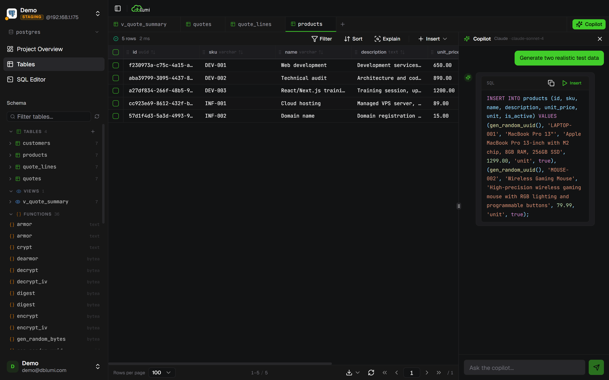

<p align="center">
  
</p>

<p align="center">
  <strong>The modern SQL client with AI, built for developer teams.</strong>
</p>

<p align="center">
  Self-hosted &middot; Open source &middot; Team-ready
</p>

<p align="center">
  <a href="https://dblumi.eodia.com"><strong>Website</strong></a> &middot;
  <a href="https://dblumi.eodia.com/guides/introduction/"><strong>Docs</strong></a> &middot;
  <a href="https://discord.gg/dblumi"><strong>Discord</strong></a>
</p>

---

## What is dblumi?

dblumi is a **self-hosted database client** that gives your team a fast, secure, collaborative SQL editor with an AI copilot built in. Your credentials never leave your infrastructure.

<p align="center">
  
</p>

## Features

**SQL Editor**
- Syntax highlighting & auto-complete for PostgreSQL, MySQL, Oracle
- 4 levels of safety guardrails (destructive query detection + confirmation)
- EXPLAIN plan analysis, streaming results, multi-tab
- Export to CSV, JSON, SQL

**AI Copilot**
- Generate SQL from natural language, explain & optimize queries
- Schema-aware context for accurate suggestions
- Supports Anthropic Claude, OpenAI, Azure OpenAI
- Bring your own API key - your data stays private

**Team Collaboration**
- Save, organize & share queries in folders
- Pin frequently used queries
- Groups with role-based access control (Admin / Editor / Viewer)
- SSO: GitHub, Google, Keycloak (OIDC)

**Version History & Timeline**
- Full version history for every saved query
- Side-by-side diff to compare any two versions
- One-click restore to roll back to a previous version
- Custom labels to tag important milestones

**REST API & Swagger**
- Full REST API — every action in the UI is available programmatically
- Interactive Swagger documentation at `/api/docs`
- Automate workflows, integrate with CI/CD, or build custom tooling
- OpenAPI spec for code generation in any language

**Schema & ERD**
- Interactive schema browser with search
- Table explorer with inline editing
- Auto-generated entity-relationship diagrams
- Structure editor for columns and types

**Security**
- 100% self-hosted - nothing in the cloud
- AES-256-GCM encrypted credentials at rest
- JWT sessions with token revocation
- Per-connection access control
- Password change & forgot password (with email reset via SMTP)
- Password strength indicator

## Quick Start

### Docker (recommended)

```bash
curl -o docker-compose.yml https://raw.githubusercontent.com/marcjamain/dblumi/main/docker-compose.yml
```

Create a `.env` file (see `.env.example` for all options):

```env
JWT_SECRET=your-long-random-secret
DBLUMI_ENCRYPTION_KEY=another-long-random-secret
```

Start:

```bash
docker compose up -d
```

Open [http://localhost:3000](http://localhost:3000) and create your admin account.

### From source

Requirements: Node.js 22+, pnpm 9+

```bash
git clone https://github.com/eodia/dblumi.git
cd dblumi
pnpm install
pnpm dev
```

The app starts on `http://localhost:5173` (frontend) and `http://localhost:3000` (API).

## Architecture

```
dblumi/
  src/
    api/        Hono.js REST API + Drizzle ORM + SQLite
    web/        React + TypeScript + Tailwind + shadcn/ui
    shared/     Shared types & utilities
  www/          Documentation site (Astro Starlight)
```

| Layer    | Stack |
|----------|-------|
| Frontend | React, TypeScript, CodeMirror, TanStack Query, Tailwind CSS, shadcn/ui |
| Backend  | Hono.js, Drizzle ORM, SQLite (app data) |
| DB Drivers | pg, mysql2, oracledb |
| Infra    | Docker, Node.js 22 |

## Environment Variables

| Variable | Required | Description |
|----------|----------|-------------|
| `JWT_SECRET` | Yes | Secret for signing JWT tokens |
| `DBLUMI_ENCRYPTION_KEY` | Yes | Key for encrypting database credentials |
| `DATABASE_PATH` | No | SQLite database path (default: `./data/dblumi.db`) |
| `BASE_URL` | No | Public URL (default: `http://localhost:3000`) |
| `GITHUB_CLIENT_ID` | No | GitHub OAuth client ID |
| `GITHUB_CLIENT_SECRET` | No | GitHub OAuth client secret |
| `GOOGLE_CLIENT_ID` | No | Google OAuth client ID |
| `GOOGLE_CLIENT_SECRET` | No | Google OAuth client secret |
| `KEYCLOAK_ISSUER` | No | Keycloak issuer URL |
| `KEYCLOAK_CLIENT_ID` | No | Keycloak client ID |
| `KEYCLOAK_CLIENT_SECRET` | No | Keycloak client secret |
| `SMTP_HOST` | No | SMTP server for password reset emails |
| `SMTP_PORT` | No | SMTP port (default: `587`) |
| `SMTP_USER` | No | SMTP username |
| `SMTP_PASS` | No | SMTP password |
| `SMTP_FROM` | No | Sender email address (e.g. `noreply@your-domain.com`) |

See the full reference in the [docs](https://dblumi.eodia.com/self-hosting/environment-variables/).

## Supported Databases

| Database   | Driver   | Status |
|------------|----------|--------|
| PostgreSQL | `pg`     | Stable |
| MySQL      | `mysql2` | Stable |
| Oracle     | `oracledb` | Stable |

## Development

```bash
# Install dependencies
pnpm install

# Start dev servers (API + frontend)
pnpm dev

# Type checking
pnpm typecheck

# Run tests
pnpm test

# E2E tests
pnpm test:e2e

# Build for production
pnpm build
```

## Contributing

Contributions are welcome! Please open an issue first to discuss what you'd like to change.

1. Fork the repository
2. Create your feature branch (`git checkout -b feat/amazing-feature`)
3. Commit your changes
4. Push to the branch
5. Open a Pull Request

## License

[AGPL-3.0](LICENSE)

---

<p align="center">
  Built with care by <a href="https://github.com/marcjamain">Marc Jamain</a>
</p>
